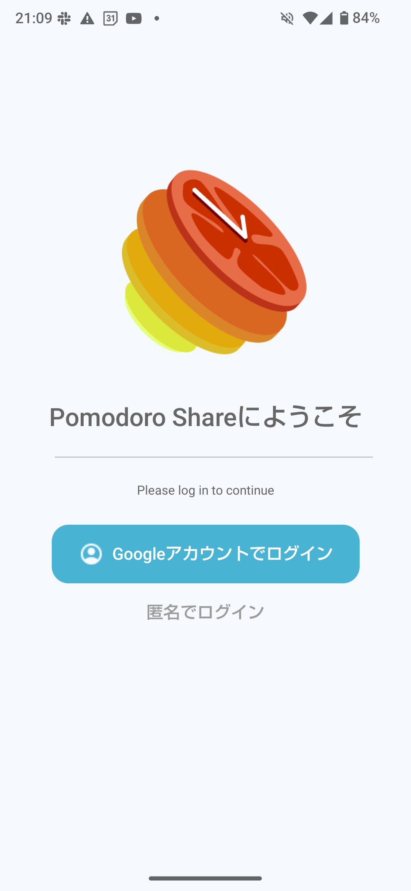
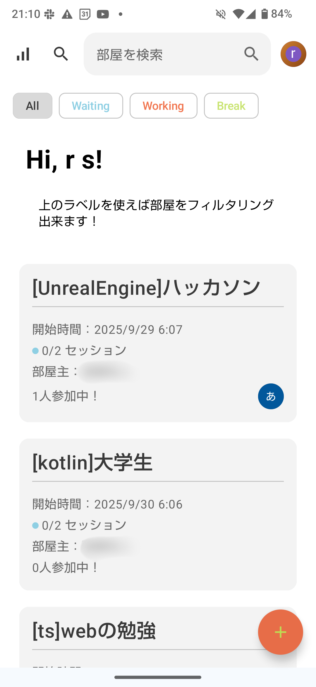
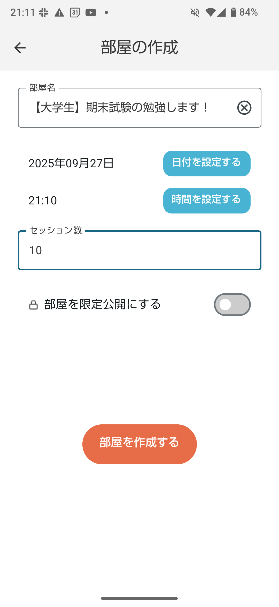
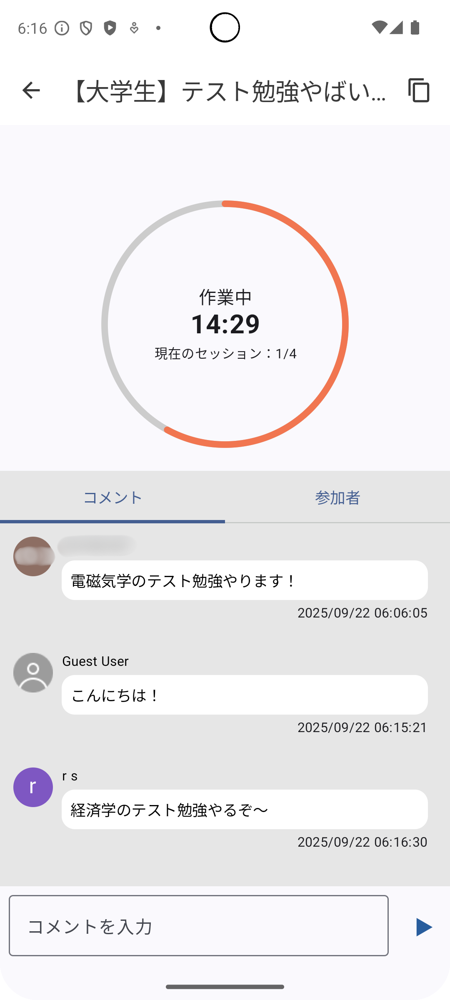
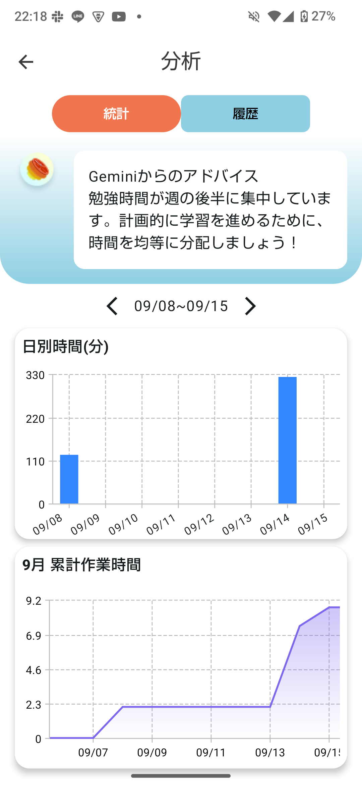
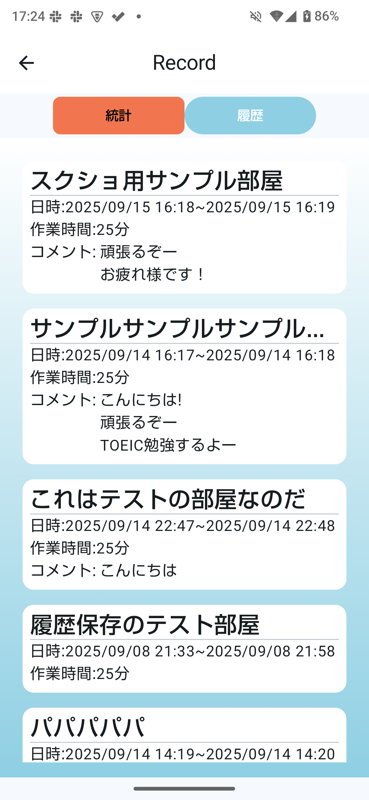
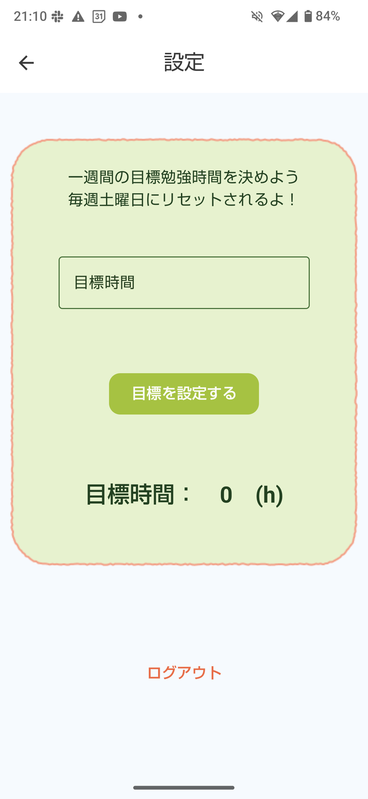
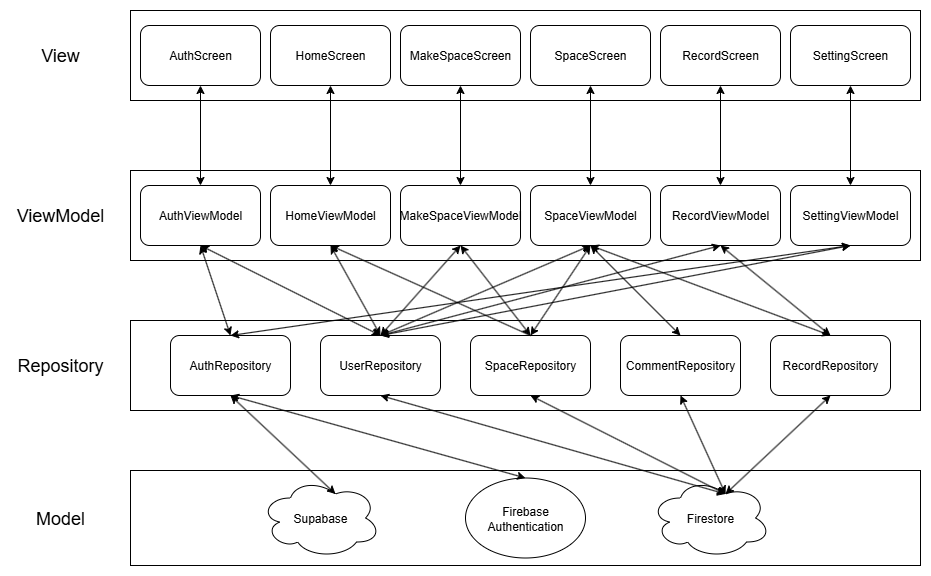

# PomodoroShare
PomodoroShareは人と作業し集中力とモチベを上げるタイマーアプリです。

## プロジェクト概要
- 開発期間：2025年8月～2025年9月
- 開発体制：3人
- 開発イベント：100 Program(第8期)
- 発表資料：<!-- 後でSpeakerDeckにでも入れてそのURLを発行する -->
  
## 開発経緯 <!-- 完了！ -->
家で一人で作業や勉強をしようとしても、緊張感がなかったり、周りに誘惑が多かったりしてなかなか集中できないという問題がありました。
しかし、カフェやコワーキングスペースにいって作業するというのはハードルが高く、既存の習慣化アプリでは「他の人と一緒にやっている感」がなかったためモチベーションを維持するのが困難でした。
そこで、習慣化アプリとしての機能を持ちつつ、オンラインで他の人と一緒に作業できるシステムを持ったアプリを開発しようと考えました。

## アプリの概要 <!-- 完了！ -->
ユーザーは、新たに部屋を作成するかすでに作成されている部屋に参加します。
それぞれの部屋には開始時刻とセッション数が設定されており、開始時刻になると25分間の作業時間が開始され、それが終わったら5分間の休憩時間があります。
この25分間の作業時間と5分間の休憩時間のサイクルをセッション数の分だけ繰り返します。
部屋内では　チャット機能もあり、他のユーザーと意気込みや進捗を共有したり、コミュニケーションをとったりしながら作業を進めることができます。

作業の記録は1セッションごとに保存され、
- 1日の合計作業時間
- 週間の合計作業時間
- 参加した部屋の履歴

などを確認することができます。

## 機能・画面の説明
| 画像                                                                   | 機能・説明                                                                                                                                                                                              |
| ---------------------------------------------------------------------- | ------------------------------------------------------------------------------------------------------------------------------------------------------------------------------------------------------- |
|        | **ログイン画面** ・Googleアカウントでログイン ・匿名ログインも可能                                                                                                                                |
|  | **ホーム画面** ・部屋の一覧を確認 ・状態ラベル(待機/作業/休憩)でフィルタリング ・部屋作成（公開/非公開の設定あり） ・人数やセッション数を表示 ・ユーザーアイコンのフレームが活動量で変化 |
|    | **部屋作成画面** ・部屋名、開始日時、セッション数を設定 ・公開/非公開の選択が可能 ・作業25分＋休憩5分のサイクルを設定した回数繰り返す                                                          |
|   | **部屋画面** ・画面上部にタイマー表示 ・開始前は「開始まで○分○秒」を表示 ・コメント投稿＆参加者一覧を表示 ・バックグラウンド移行時に復帰を促す通知あり                                      |
|           | **統計画面** ・直近1週間の勉強時間に基づきAIコメントを表示 ・日別勉強時間の棒グラフ ・月ごとの累計時間の折れ線グラフ                                                                           |
|           | **履歴画面** ・参加した部屋の情報を新しい順に表示 ・部屋名・勉強時間を確認 ・投稿したコメントも表示                                                                                            |
|          | **設定画面** ・1週間の目標勉強時間を設定 ・ログアウトが可能                                                                                                                                       |  |
  
## 技術スタック <!-- 完了！ -->
- 言語: Kotlin
- UI: Jetpack Compose
- データベース: Firestore,Supabase
- ユーザー認証: Firebase Authentication
- 画像読み込み: Coil
- 画面遷移: kotlin serialization
- 依存関係注入: Hilt
- グラフ表示: Vico
- 通知: WorkManager
- バージョン管理: GitHub
- タスク管理: Notion,Slack
  
## アーキテクチャ図 <!-- 完了！ -->
このアプリはMVVM(Model-View-ViewModel)アーキテクチャに基づいて設計されています。以下の図は、アプリの主要なコンポーネントとその相互作用を示しています。

  
## 工夫した点<!-- 完了！ -->
### 技術面
**タイマー同期の設計**
- 課題：
  - 部屋参加ユーザー全員でタイマーが同期されること（誤差数秒以内）
  - 端末スリープ中でも正しく動作すること
  - 途中参加ユーザーも正しい状態を取得できること
- 解決策：
  1. 部屋作成時に開始時刻とセッション数をFirestoreに保存
  2. 各端末でローカル時間と開始時刻の差分を計算し、現在のタイマー状態を算出
- 効果：
  - 端末スリープ中でも正しい状態を計算可能
  - 途中参加ユーザーも正しいタイマー状態を取得
  - Firestoreアクセス回数を最小化し、パフォーマンス向上とコスト削減

**ユーザー情報の保存**

- 課題：
  - Firebase Authenticationで認証はできるが、ユーザーのアイコン画像をFirestoreに直接保存できない
  - 端末ごとに画像情報を保持するだけでは同期や管理が困難

- 解決策：
  1. Firebase Authenticationでユーザー認証を行う
  2. FirestoreにIDやユーザー名など基本情報を保存
  3. 端末側でFirestore上のIDトークンを取得
  4. SupabaseのストレージにIDトークンを使って画像を保存し、URLを取得
  5. Firestore上のユーザー情報に画像URLを保存

- 効果：
  - ユーザー情報とアイコン画像を安全に管理できる
  - 認証情報と画像情報が分離されることで、システムの柔軟性と拡張性が向上
  
### UI/UX面
- 部屋画面で作業中、バックグラウンド移行後一定時間経過すると通知を送る
  - 狙い：作業中に他のアプリを開いてサボるのを防ぐ
  - 効果：ユーザーが集中を維持しやすくなる

- ホーム画面で部屋一覧を表示し、参加人数やセッション数を可視化
  - 狙い：部屋の状況を一目で把握でき、参加判断を容易にする
  - 効果：「他のユーザーも作業中」という感覚を得られ、孤独感を軽減

- 部屋画面からホーム画面に戻ったときに、もといた部屋を強調して表示
  - 狙い：ユーザーが自分の参加している部屋を見失わないようにする
  - 効果：ユーザーが安心してアプリを利用できる
### チーム開発面
- Notionで躓きや注意点を共有
  - 効果：知識の蓄積・チーム全員の理解の共有が可能

- GitHubでブランチ戦略を徹底
  - main: 完成品
  - develop: 開発中心ブランチ
  - 作業ブランチ: 各メンバーが個別に作業
  - 効果：コンフリクトを最小化し、開発効率を向上